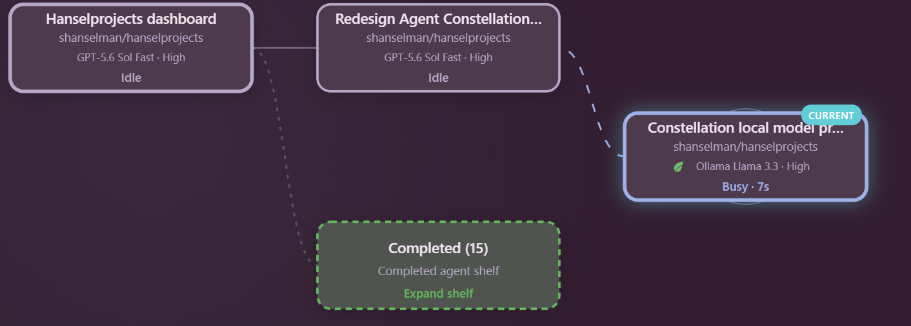

# Agent Constellation

[](https://github.com/shanselman/agent-constellation/actions/workflows/ci.yml)
[](https://github.com/shanselman/agent-constellation/releases)
[](LICENSE)

**Agent Constellation is a live, animated family tree and mission-control view for GitHub Copilot project sessions.** It turns a coordinator and its descendant sessions into an accessible canvas where you can see what is busy, idle, completed, waiting for you, or blocked.



## Why this exists

Copilot can coordinate work across several project sessions, but a text list makes it hard to answer basic operational questions:

- Which session created which descendant?
- What is still working?
- Which session needs a user response or plan approval?
- Which agents have completed and can get out of the way?
- Which repository, branch, model, and reasoning effort belong to each session?

Agent Constellation makes those relationships visible. The current session is marked, parent-child edges show the family tree, animated edges and halos indicate active work, status colors highlight attention, and a details inspector exposes sanitized metadata for a selected session.

## Highlights

### Live family tree and mission control

The canvas follows the topmost accessible ancestor of the current session and includes that session's descendant project sessions. Cards show the session name, repository, current status, and—when available—the selected model and reasoning effort.

Statuses include:

- **Busy** with elapsed working time
- **Waiting for user**
- **Waiting for plan approval**
- **Blocked** on a permission decision
- **Failed**
- **Idle**
- **Completed**
- **Archived**

Completed descendants collapse into a **Completed shelf** so a large constellation remains readable. Expand the shelf when you need to inspect finished work.

### Operational mission briefing

A collapsible briefing above the constellation summarizes the visible sanitized local state in a fixed order:

- Active work
- Decisions needed
- Failures
- Blocked sessions
- Timestamped completions from the last 24 hours
- Repository spread
- Possible bottleneck signals

The briefing is deterministic and local. It does not call an LLM or network service, and it never reads prompts, message text, tool arguments, or repository file contents. Every statement comes from the same already-sanitized session metadata used by the constellation.

Bottleneck entries are deliberately phrased as **signals, not diagnoses**. The current fixed thresholds are two or more pending user/plan decisions, any blocked or unrecovered failed session, a busy session observed for at least two hours, or at least three attention sessions concentrated in one repository and representing at least 60% of visible attention work.

The panel explicitly labels partial metadata coverage. Empty and single-session states avoid inventing coordination risk: no visible sessions does not prove that no work exists, and a single visible session is reported as having no coordination spread.

### Responsive side-pane layout

Wide canvases use a horizontal family-tree layout. Narrow or tall side panes automatically switch to a compact vertical mission-control layout with readable cards, horizontal ancestry, and scrollable depth. The toolbar also condenses for narrow panes.

### Model and reasoning badges

When Copilot exposes model metadata, cards and the inspector display a conservative human-readable label such as `GPT-5.6 Sol Fast · High`. Missing provider or model fields are handled without hiding the session.

### Local-model leaf semantics

A leaf icon means the session has explicit local-runtime metadata. The classifier intentionally recognizes only:

- Providers named `ollama`, `winml`, or `local`
- Model identifiers beginning with `ollama/`, `ollama:`, `winml/`, `winml:`, `local/`, or `local:`

Model names such as `llama`, `phi`, `mistral`, or `qwen` are **not** assumed to be local without that explicit metadata.

For demonstrations, the canvas accepts an isolated `demoLocalModel: true` open input. It decorates only the current session in the returned canvas state and does not alter stored Copilot session data or affect other open Agent Constellation instances.

### Real-time updates

Each open canvas gets its own dependency-free HTTP server bound to an ephemeral `127.0.0.1` port. Server-Sent Events push state changes to the canvas, with lightweight polling as a fallback. Manual refresh and the agent-callable `refresh` action are also available.

## Privacy and local security

Agent Constellation is deliberately local-first:

- Reads Copilot's local SQLite databases in **read-only** mode.
- Reads only a bounded tail of local session event metadata.
- Returns sanitized identifiers and operational metadata—not prompts, chat messages, secrets, tool arguments, or repository file contents.
- Binds its renderer server to `127.0.0.1` only.
- Requires an unguessable per-canvas bootstrap token, then stores it in an `HttpOnly`, `SameSite=Strict` cookie.
- Rejects non-loopback hosts, cross-site requests, oversized request bodies, and unexpected refresh payloads.
- Uses a restrictive Content Security Policy and loads no CDN assets.
- Has zero runtime npm dependencies and makes no external network requests.

The inspector reports when a local data source is unavailable and the resulting status or relationship information is partial.

## Install

The stable extension folder URL is:

```text
https://github.com/shanselman/agent-constellation/tree/main/.github/extensions/agent-constellation
```

### User scope

User scope makes the extension available across your Copilot projects.

1. Open the GitHub Copilot command palette.
2. Search for **Install extension**.
3. Choose user scope.
4. Paste the repository folder URL above.

You can also ask Copilot naturally:

> Install the Agent Constellation extension at user scope from https://github.com/shanselman/agent-constellation/tree/main/.github/extensions/agent-constellation

### Project scope

Project scope commits the extension under a repository's `.github/extensions/` directory so everyone using that project can discover it. Install the same folder URL and choose project scope, or copy the `agent-constellation` folder into:

```text
.github/extensions/agent-constellation/
```

A project-scoped extension with the same name takes precedence over a user-scoped installation.

## Use

Start from a Copilot project session, then ask:

> Open Agent Constellation

Copilot opens the canvas for the current session family. You can also request an initial filter:

> Open Agent Constellation filtered to busy sessions.

For an explicit local-model UI demonstration:

> Open Agent Constellation with `demoLocalModel` set to `true`.

### Controls and gestures

- **Refresh** reloads local session metadata.
- **Mission briefing** expands or collapses the deterministic operational summary.
- **Current** centers the current session.
- **Width** fits the tree to a readable minimum card scale.
- **+ / -** zooms.
- **Filter** narrows by status or repository.
- **Click or press Enter/Space** on a session to open its inspector.
- **Arrow keys** move focus directionally between session cards.
- **Click the Completed shelf** to expand or collapse completed descendants.
- **Drag empty canvas space** to pan.
- **Pinch** with two touch or pointer contacts to zoom and pan around the moving midpoint.
- **Ctrl + wheel** zooms around the pointer.
- **Double-click empty canvas space** to zoom in.
- **Escape** closes the inspector.

Animations honor `prefers-reduced-motion`.

## Update or reinstall

Re-run the install flow with the same repository folder URL to fetch the latest version. If the extension is already loaded, reload extensions or begin a new Copilot session so discovery uses the updated files.

If you have both user- and project-scoped copies, update the project copy first because it shadows the user copy for that repository.

## Architecture

The installable extension lives entirely in [`.github/extensions/agent-constellation/`](.github/extensions/agent-constellation/):

| File | Responsibility |
|---|---|
| `extension.mjs` | Declares the canvas, open schema, actions, and lifecycle with the Copilot SDK. |
| `data.mjs` | Reads local sources, derives statuses and relationships, sanitizes metadata, filters state, and isolates demo decoration. |
| `briefing.mjs` | Builds the versioned deterministic operational briefing and fixed bottleneck heuristics from sanitized state. |
| `layout.mjs` | Produces deterministic horizontal/vertical layouts, completed-shelf behavior, model labels, fit scaling, and pinch transforms. |
| `renderer.mjs` | Generates the accessible, responsive, theme-aware canvas UI. |
| `server.mjs` | Hosts the token-protected loopback page, JSON state, refresh endpoint, and SSE stream. |
| `agent-constellation.test.mjs` | Covers collection, sanitization, relationships, responsive layout, gestures, local-model semantics, renderer accessibility, and loopback protections. |
| `copilot-extension.json` | Identifies the folder as a shareable/installable Copilot extension. |

### Local data sources

When present under `COPILOT_HOME` (normally `~/.copilot`), the extension combines:

- `data.db` for project-session, workspace, relationship, activity, model, and reasoning metadata
- `session-store.db` for repository, branch, and reference fallbacks
- `session-state/<session-id>/events.jsonl` for bounded operational timing and human-gate inference

The extension tolerates missing tables, columns, databases, and event files. It degrades to the metadata that is available and reports limitations in the canvas.

## Limitations

- Agent Constellation visualizes **Copilot project sessions and their recorded descendants**. In-process task subagents are not separate project sessions and therefore do not appear as individual cards.
- It follows the current session's accessible ancestor/descendant tree, not every unrelated Copilot session on the machine.
- Copilot's local app data schema can evolve. The collector uses guarded reads and fallbacks, but a future schema change may temporarily reduce available metadata.
- Statuses are inferred from local app state and recent event metadata; unavailable sources reduce precision.
- Mission briefing conclusions are limited to the visible ancestor/descendant tree and available sanitized metadata. Its bottleneck heuristics indicate threshold matches, not root causes or predictions.
- A completion is considered recent only when a sanitized completion timestamp falls within the previous 24 hours.
- Local-model classification requires explicit provider or runtime-prefixed model metadata.
- The canvas is a local operational view, not a durable historical analytics store.
- Canvas extensions require a GitHub Copilot build with extension canvas support.

## Development

Requirements:

- Node.js 24 (Node.js 22.5 or newer is required for `node:sqlite`)
- npm
- Git

Install development dependencies and run every check:

```console
npm ci
npm run check
```

Individual commands:

```console
npm test
npm run check:types
npm run check:syntax
npm run check:diff
```

The TypeScript check compiles a small SDK contract fixture so changes to canvas declarations, action handlers, or open/close callback types fail early. The implementation modules are also parsed with `node --check` and exercised through the Node test suite.

To exercise the extension in this repository, reload Copilot extensions, open **Agent Constellation**, invoke its `refresh` and `get_state` actions, and verify invalid open/action inputs are rejected by the SDK schema.

The extension intentionally has **no runtime dependencies**. Keep renderer assets self-contained and preserve the loopback, token, sanitization, and read-only database guarantees.

## Contributing

See [CONTRIBUTING.md](CONTRIBUTING.md). Focused bug fixes, compatibility improvements, accessibility work, tests, and carefully bounded visualization enhancements are welcome.

## Roadmap

Potential future work, guided by stable Copilot data surfaces:

- Additional relationship and attention cues without increasing visual noise
- More compact controls for very narrow panes
- Optional snapshot/export workflows that preserve the privacy model
- Compatibility updates as public session metadata evolves

## Provenance

The initial public `v1.0.0` implementation was imported byte-for-byte from `shanselman/hanselprojects` at merge commit [`c4142fa`](https://github.com/shanselman/hanselprojects/commit/c4142fa35870550d2d7776a30d2e3f95162c1dcf), then packaged here with public documentation, checks, and release metadata.

## License

[MIT](LICENSE)
